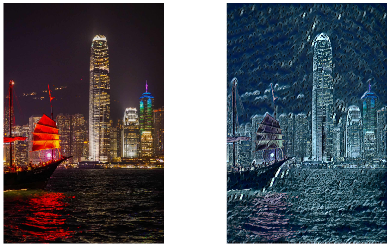
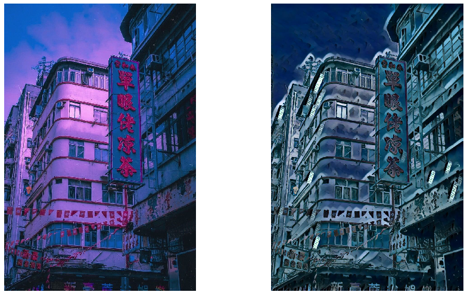

## Neural Style Transfer in FastAI
Implementing ["Perceptual Losses for Real-Time Style Transfer and Super-Resolution"](https://arxiv.org/pdf/1603.08155.pdf) with FastAI framework. Apply hook (PyTorch mechanism) to calculate loss.

## Style Source

<figcaption>

<a href="https://www.facebook.com/Cuson.LoChiKong/photos/t.657699147/2269082743183734/?type=3&theater">An Artwork from HK Artist, Cuson Lo
</a>

</figcaption>

## Stylized Samples     

## Reference
1. [fastai -- Extracting Intermediate Features Using Forward Hook](https://github.com/TheShadow29/FAI-notes/blob/master/notebooks/Using-Forward-Hook-To-Save-Features.ipynb)
2. [fastai -- 06_cuda_cnn_hooks_init.ipynb, Deep Learning for Coder part 2 v3](https://github.com/fastai/course-v3/blob/master/nbs/dl2/06_cuda_cnn_hooks_init.ipynb)
3. [fastai -- documentation on what a callback can unpack from kwargs](https://docs.fast.ai/callback.html)
4. [fastai2 -- another implementation on fast neural style transfer](https://github.com/lgvaz/projects/blob/master/vision/style/coco.ipynb)
5. [pytorch -- fast-neural-style](https://github.com/pytorch/examples/tree/master/fast_neural_style)
6. [tensorflow -- fast neural style transfer with a rich documentation](https://github.com/lengstrom/fast-style-transfer)
7. [arxiv -- Instance Normalization: The Missing Ingredient for Fast Stylization](https://arxiv.org/abs/1607.08022)
8. [arxiv -- Perceptual Losses for Real-Time Style Transfer and Super-Resolution](https://arxiv.org/abs/1603.08155)
9. [medium -- 10 Useful ML Practices For Python Developers](https://medium.com/modern-nlp/10-great-ml-practices-for-python-developers-b089eefc18fc)

## Log
[05/04/2020]
- apply hook on callbacks
- add tensorboard callbacks with gram matrix, stylised images